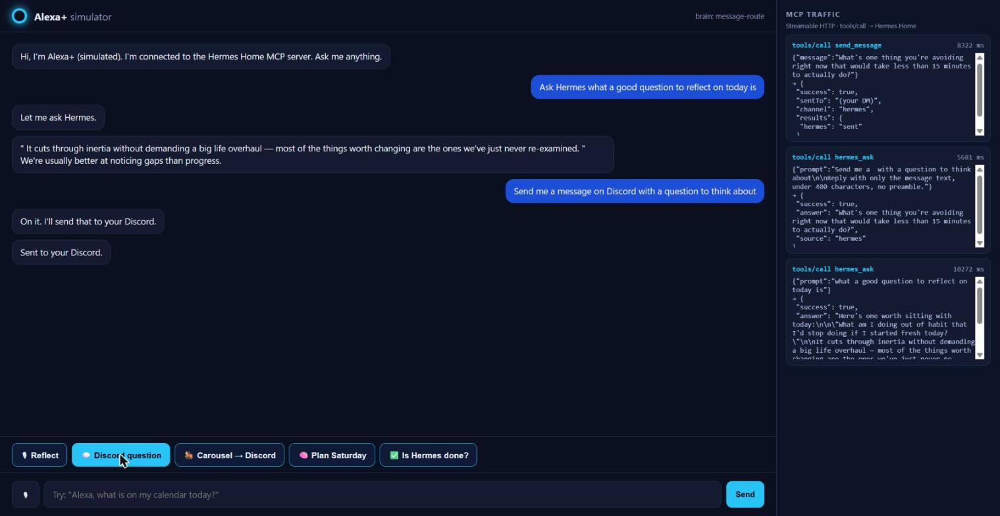

# Hermes Home

**Alexa+ on the front. Hermes as the agent underneath.**

> Amazon Developer Hackathon — **Alexa+ track** (self-hosted MCP server, Streamable HTTP, spec 2025-11-25) · also entered in the **Open Source** mini challenge (MIT).

Alexa+ integrates through remote **Streamable-HTTP MCP servers**; the Hermes personal-agent
runtime only ships a stdio MCP server. Hermes Home is the bridge: it exposes a small,
hand-picked set of tools to Alexa+ and keeps every long task asynchronous, so a voice
assistant never waits on a slow agent.



## Try it in 2 minutes (simulated Alexa+)

No Alexa+ Preview access is needed. `apps/dashboard` contains an **Alexa+ simulator**: a voice/chat
web app that acts as the MCP *client* (official `@modelcontextprotocol/sdk`), lists the server's tools,
calls them over Streamable HTTP, and shows every `tools/call` in a live trace panel.

```powershell
npm install
copy .env.example .env      # set HERMES_API_URL / HERMES_API_KEY (and PORT if 3000 is busy)
npm run demo                # tunnel -> MCP bridge -> simulator, verified
# open http://127.0.0.1:3100/sim
```

Things to say: *"Ask Hermes what a good question to reflect on today is"* ·
*"Send me a message on Discord with a question to think about"* ·
*"Ask Hermes to plan a productive Saturday"* → *"Is Hermes done?"*

Optional: set `GOOGLE_API_KEY` and the simulator lets Gemini pick tools by function-calling (like real Alexa+);
without it a keyword router is used. Anything that mentions "Hermes" is routed straight to the agent.

## What is exposed (14 tools — never the whole Hermes catalogue)

`hermes_ask` · `hermes_start_task` · `hermes_task_status` · `hermes_task_result` · `home_get_state` ·
`home_control` (two-step confirm) · `hermes_memory_search` · `hermes_remember` · `calendar_today` ·
`calendar_tomorrow` · `calendar_events` · `github_my_issues` · `github_repo_issues` · `send_message`.
Calendar, Home Assistant and GitHub activate when their credentials are in `.env`; otherwise they
return a clear "not configured" result.

## Safety design
Fail-closed Hermes gate (server refuses to boot without a live agent) · per-user run/memory isolation ·
DNS-rebind guard · RS256/JWKS OAuth2 mode for internet exposure · home control requires explicit confirmation ·
the simulator redacts DM handles/IDs from its trace. See [`docs/privacy.md`](docs/privacy.md).

## Submission notes
Hackathon deliverables live in [`docs/submission.md`](docs/submission.md) (description, product feedback,
friction log pointers). Audit/continuation guide: [`docs/handoff.md`](docs/handoff.md). Hermes VM wiring: [`docs/hermes-vm.md`](docs/hermes-vm.md).

---

> **Current state — local-only, MVP track.**
> This repo contains the working Alexa+ ↔ Hermes bridge: a public-safe
> **Streamable HTTP MCP server** (`apps/mcp-server`) that answers quickly,
> safely, and only from a real Hermes runtime. It runs **loopback-first**:
> out of the box it is intentionally reachable only from the machine it's on
> (DNS-rebind guard on Host/Origin). Alexa+ onboarding (Cloudflare Tunnel +
> OAuth 2.1/PKCE) is documented in [`docs/alexa.md`](docs/alexa.md) and
> [`docs/oauth-reference/README.md`](docs/oauth-reference/README.md) and is
> the explicit next step — everything before it already works on localhost.
> If the Hermes gateway is down the server **refuses to start** rather than
> demo against a stub (`HERMES_REQUIRED=false` exists for tests only).

```
┌──────────────┐       ┌───────────────┐
│    USER      │──────▶│    ALEXA+     │  voice + display
└──────────────┘       └──────┬────────┘
                              │ Streamable HTTP MCP
                              ▼
               ┌─────────────────────────────┐
               │  HERMES HOME — MCP SERVER   │  the only public component
               └──────────────┬──────────────┘
                              │
              ┌───────────────┼───────────────┐
              ▼               ▼               ▼
        fast tools      Hermes HTTP API    local state
        (home, memory)  (127.0.0.1:8642)   (memory · runs)
                              │
                              ▼
                     ┌─────────────────┐
                     │  HERMES AGENT   │ memory · browser · subagents · MCP
                     └────────┬────────┘
                              ▼
          Home Assistant · Calendar · GitHub · Messages · Muse …
```

> **📋 New here?** Read [`docs/handoff.md`](docs/handoff.md) first — it's a
> proof-oriented audit & continuation guide: what's built, what each red
> onboarding row means, and the exact commands to re-verify every claim.

## Why

Alexa is a great conversational surface; Hermes is a persistent personal agent
(memory, long-running tasks, tools, integrations). Hermes Home gives the user
**a single conversational doorway into both** (spec §1) — no new intents, no
hard-coded commands: Alexa+ decides when Hermes' tools apply.

## Quick start — everything, one command

```powershell
git clone <this-repo>; cd hermes-home
npm run dev                 # installs, builds, spawns MCP server + dashboard + optional tunnel
```

Then **prove it's ready to connect** before touching Alexa:

```powershell
npm run onboard             # runs the full spec §41 readiness ladder with colored pass/fail
```

You'll get a line-by-line readiness report for: MCP health, Hermes reachability,
protocol handshake, tool discovery, the DNS-rebind guard, OAuth discovery
documents, and which integrations are configured. When the top sections are
green, expose and onboard:

```powershell
cloudflared tunnel --url http://localhost:3000
# then follow docs/alexa.md onboarding checklist
```

Or run pieces by hand: `npm run dev:mcp`, `npm run dev:dashboard`.

## Tools exposed to Alexa+

Deliberately small (spec §10) — never the whole Hermes catalog:

| Tool | Purpose | Notes |
|---|---|---|
| `hermes_ask` | Quick Q&A from Hermes context | bounded timeout |
| `hermes_start_task` | Long async run — research, planning | returns a `runId` in ~50 ms |
| `hermes_task_status` / `hermes_task_result` | Follow up on a run | per-user ownership checked |
| `hermes_memory_search` / `hermes_remember` | Personal memory | `source: 'memory'` tagged, per-user |
| `home_get_state` | "Are my office lights on?" | read-only |
| `home_control` | "Turn the office lights on" | two-step confirm, rate-limited, sensitive-domain guarded (spec §17) |
| `calendar_today` / `calendar_tomorrow` / `calendar_events` | "What's on my calendar tomorrow?" | iCal/CalDAV, read-only |
| `github_my_issues` / `github_repo_issues` | "What should I work on?" | read-only triage |
| `send_message` | "Ping me on Telegram when it's done" | outbound notifications |

## Repository layout

```
apps/
  mcp-server/         the public Alexa+ MCP bridge (this is the product)
  dashboard/          developer/debug surface on :3100 (spec §46)
integrations/         adapter skeletons (Home Assistant done; calendar/message/muse/config stubs)
packages/shared/      types, zod schemas, constants
docs/                 architecture, alexa, hermes, oauth reference, memory, privacy, friction log
```

## Commands

```powershell
npm run dev              # everything: builds, starts MCP server (:3000) + dashboard (:3100)
npm run dev:mcp          # MCP server only (tsx watch)
npm run dev:dashboard    # debug dashboard only
npm run onboard          # full readiness ladder (spec §41) — the "is it ready to connect?" check
npm run smoke            # lighter pass/fail smoke
npm test                 # unit + protocol + safety tests
npm run build            # type-check + build all workspaces
hermes gateway           # Hermes HTTP API (separate runtime)
cloudflared tunnel --url http://localhost:3000  # public HTTPS for Alexa+
```

## Safety & trust boundaries (what reviewers should notice)

- **Bound-local default**: Host/Origin DNS-rebind guard — a web page can't drive your laptop's MCP port.
- **Fail-closed on Hermes**: no reachable gateway, no server. No canned answers.
- **Confirmation-before-execution** for every physical action; security-sensitive
  domains (locks/alarms/covers) never act without an explicit out-loud confirm.
- **Per-user run & memory ownership**: another user's `runId` is "unknown".
- **Latency budget honored**: long work is always async via `/v1/runs` — Alexa+
  never waits on a 20 s agent loop (spec §36).

## Roadmap

- [x] Bridge MVP (ask / start / status / result / memory / home)
- [ ] Alexa+ onboarding via tunnel + OAuth 2.1 account linking
- [ ] Home Assistant live test on real devices
- [ ] Physical Alexa device validation
- [ ] Calendar / messaging / GitHub adapters (config-driven, `integrations/generic-mcp`)
- [ ] Muse adapter (optional; license-gated, descriptive metrics only)
- [ ] Registry-remote track: export `tool-config.json` so Hermes consumes Hermes Home as MCP (`hermes/registrations.ts`)

## License

MIT — see [LICENSE](LICENSE).
